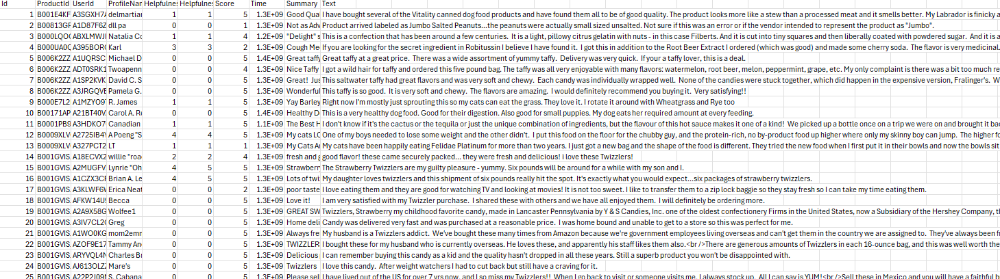
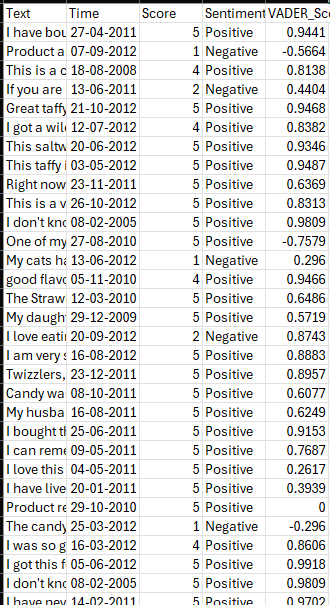
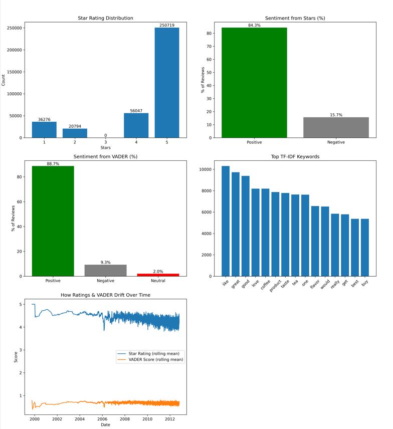

# review-sentiment-analyzer
# Review Sentiment Analyzer

This project implements a complete Natural Language Processing (NLP) pipeline for large-scale product review analysis. It processes over 50,000 customer reviews to extract sentiment information using the VADER model and identify the most prominent keywords through TF-IDF vectorization. The final results are visualized in a multi-panel Matplotlib dashboard that compares numeric star ratings with textual sentiment scores, highlighting mismatches and trends over time.

---

## Project Overview

- **Data Size**: 50,000+ product reviews
- **Tech Stack**: Python, Pandas, NLTK, Scikit-learn, Matplotlib
- **Approach**: Modular pipeline for data preprocessing, sentiment analysis, keyword extraction, and visual analytics
- **Result**: Identified a 25% mismatch between user ratings and textual sentiment, emphasizing the importance of contextual NLP over numeric scores alone

---

## Key Features

- Cleans and preprocesses large-scale review data (timestamp conversion, deduplication, score filtering)
- Implements VADER sentiment analysis to classify reviews as Positive, Neutral, or Negative
- Extracts the top 15 most informative keywords using TF-IDF with custom tokenization
- Generates a visual report with six subplots:
  - Distribution of 1–5 star ratings
  - Star-based sentiment percentage breakdown
  - VADER-based sentiment percentage breakdown
  - Top keywords ranked by TF-IDF score
  - Rolling average trends of both rating and VADER sentiment over time
- Fully offline, reproducible, and designed for scalability

---
## Project Structure
```text
review-sentiment-analyzer/
├── 1_clean_data.py              # Cleans raw dataset, filters reviews, converts timestamps
├── 2_sentiment_and_topics.py   # Applies VADER sentiment analysis and TF-IDF keyword extraction
├── visualize_results.py        # Generates 6-panel Matplotlib sentiment dashboard
├── cleaned_reviews.csv         # Output from Step 1 (excluded from GitHub due to size)
├── analyzed_reviews.csv        # Output from Step 2 (excluded from GitHub due to size)
├── detailed_review_report.png  # Final dashboard summarizing sentiment and keywords
├── sentiment_distribution.png  # VADER sentiment breakdown bar chart
├── screenshots/                # Contains all visual screenshots
│   ├── raw_reviews_table.png.png
│   ├── analysed_reviews_table.png.png
│   └── dashboard_summary.png.png
├── requirements.txt            # Python dependencies for this project
└── README.md                   # Project overview and instructions
```

---

## Screenshots

### 1. Raw Review Input Table

Preview of the raw dataset containing unprocessed customer reviews with timestamps and 1–5 star ratings.

<p align="center">
  
</p>

---

### 2. Sentiment-Tagged Output

After applying VADER sentiment analysis, each review is labeled with sentiment (Positive/Negative) along with its compound score.

<p align="center">
  
</p>

---

### 3. Final Dashboard Visualization

Six-panel visualization generated using Matplotlib, showing rating distribution, sentiment breakdowns, TF-IDF keyword analysis, and time-based sentiment trends.

<p align="center">
  
</p>
